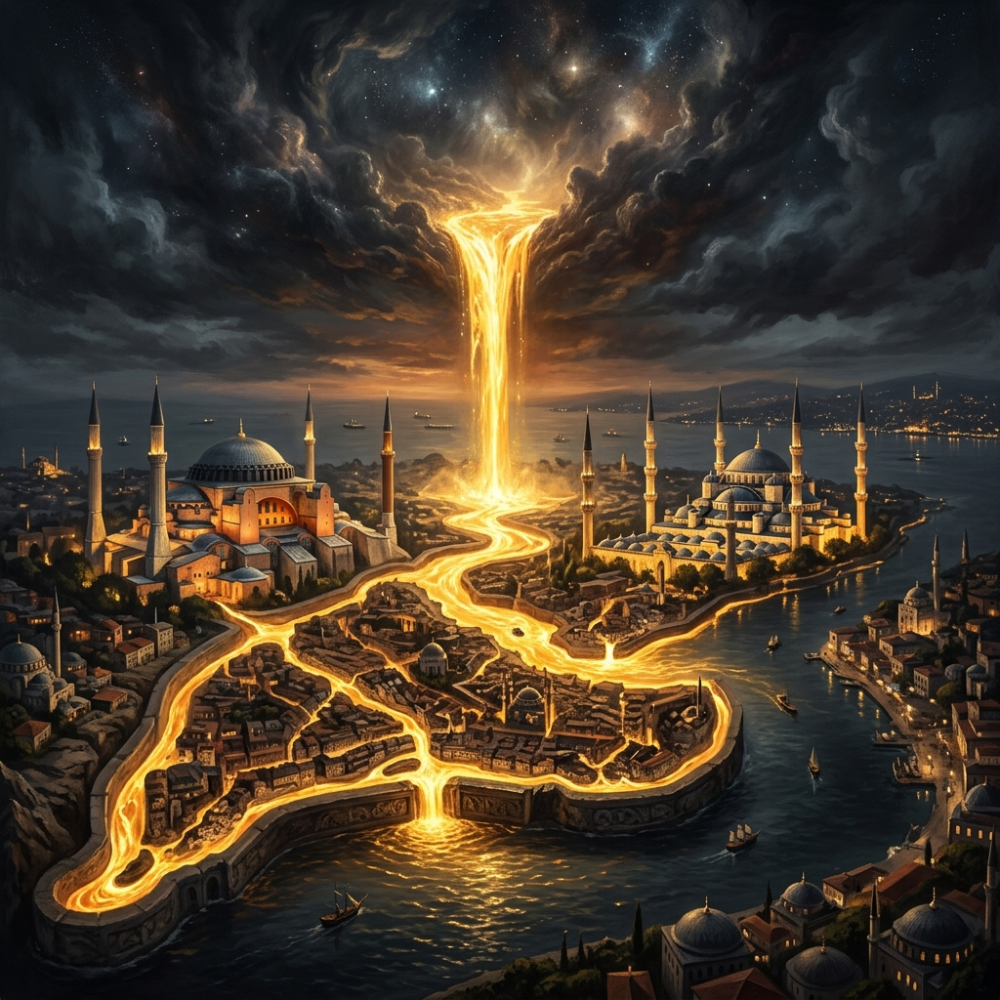

# 🌉 Words of Istanbul (İstanbul'un Sözleri)



> *"Ruhumu eritip de kalıpta dondurmuşlar;  
> Onu İstanbul diye toprağa kondurmuşlar."*  
> — **Necip Fazıl Kısakürek**

**Words of Istanbul**, yalnızca rastgele seçilmiş alıntıların alt alta dizildiği sıradan bir metin deposu değildir. Bu proje; asırları birleştiren bir ruhun, bir "kalıba dökülmüş medeniyetin" psikolojik ve edebi röntgenidir. Biz burada sadece surları değil, Necip Fazıl'ın deyimiyle "ruhun toprağa kondurulmuş hali" olan o mistik dokuyu anlamaya çalışıyoruz.

---

## 📑 Kapsamlı İçindekiler
1. [Şehrin Ruhu: Hüzün, Karmaşa ve Sonsuz Devinim](#1-şehrin-ruhu-hüzün-karmaşa-ve-sonsuz-devinim)
2. [İki Kıtanın Çarpışması: Asya ve Avrupa'nın Fısıltısı](#2-i̇ki-kıtanın-çarpışması-asya-ve-avrupanın-fısıltısı)
3. [İmparatorlukların Başkenti: Taçlar, Kılıçlar ve Siyaset](#3-i̇mparatorlukların-başkenti-taçlar-kılıçlar-ve-siyaset)
4. [Şiirlerin ve Kalemlerin Şehri: Edebi Hafıza](#4-şiirlerin-ve-kalemlerin-şehri-edebi-hafıza)
5. [Şehrin Sesleri ve Yüzleri: Sokakların Senfonisi](#5-şehrin-sesleri-ve-yüzleri-sokakların-senfonisi)
6. [Mitolojik Kökler, Efsaneler ve Yeraltı Sırları](#6-mitolojik-kökler-efsaneler-ve-yeraltı-sırları)
7. [Devasa Depo Hiyerarşisi](#7-devasa-depo-hiyerarşisi)
8. [Nasıl Okunur ve Kullanılır?](#8-nasıl-okunur-ve-kullanılır)
9. [Lisans ve Mimari](#9-lisans-ve-mimari)

---

## 1. Şehrin Ruhu: Necip Fazıl ve Varoluşsal Denge

İstanbul, harita üzerinde işaretlenebilecek sıradan bir coğrafya parçası değil; bir şairin ruhunun taşa ve toprağa bürünmüş halidir. Necip Fazıl'ın "Canım İstanbul" şiirinde vurguladığı o "eriyip kalıba giren ruh" imgesi, şehrin her bir kubbesinde ve her bir kavisinde gizlidir.

* **Ruhun Kristalizasyonu:** İstanbul, bir medeniyetin en yüksek ideallerinin somutlaşmış halidir.
* **Hüzün ve Kader:** Şehir, hem bir "yar" (sevgili) hem de bir "çile" mekanıdır. Bu ikilik, İstanbullu olmanın temelini oluşturur.

---

## 2. İki Kıtanın Çarpışması: Asya ve Avrupa'nın Fısıltısı
*(İçerik devam etmektedir...)*

---

## 3. İmparatorlukların Başkenti: Taçlar, Kılıçlar ve Siyaset

* *"Dünya tek bir devlet olsaydı, başkenti İstanbul olurdu."* — **Napalyon Bonapart**
* *"Ya ben İstanbul'u alırım, ya İstanbul beni!"* — **Fatih Sultan Mehmet**

---

## 7. Devasa Depo Hiyerarşisi

```text
words-of-istanbul/
│
├── README.md                          # Projenin kalbi ve ana manifesto
│
├── 01_psikoloji-ve-huzun/             # Şehrin ruh hali ve NFK ekolü analizleri
├── 02_imparatorluklar-ve-siyaset/     # Siyasi liderlerin ve fatihlerin alıntıları
├── 03_edebiyat-ve-siir/               # Edebi dehaların kaleminden İstanbul
├── 04_sehrin-sesleri-ve-yuzleri/      # Gündelik doku ve mahalle kültürü
├── 05_mitoloji-ve-efsaneler/          # Şehrin mistik kökenleri
└── assets/                            # Tasarlanan bannerlar ve görsel medya
```

---
*İnsan İstanbul'da yorulur ama asla sıkılmaz.*