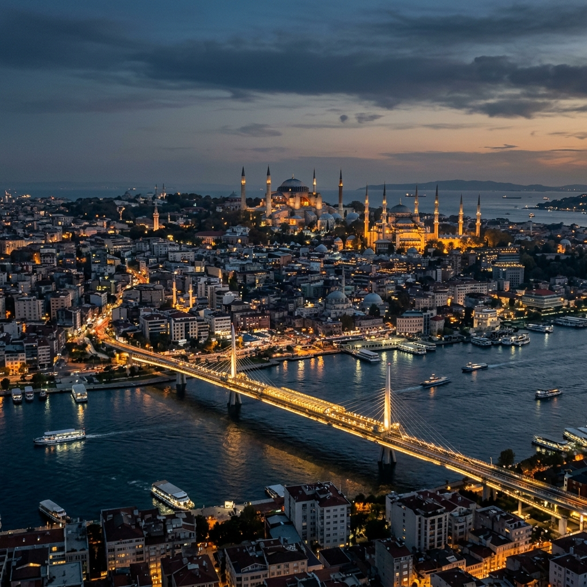

# 🏛️ Words of Istanbul: The Eternal City (v3.2.0-UNITY)



> *"Ruhumu eritip de kalıpta dondurmuşlar; / Onu İstanbul diye toprağa kondurmuşlar."* — **Necip Fazıl Kısakürek**

**Words of Istanbul**, yalnızca rastgele seçilmiş alıntıların alt alta dizildiği sıradan bir metin deposu değildir. Bu proje; Asya ve Avrupa kıtalarının sularla öpüştüğü o ince çizgide kurulan, üç büyük ve kadim imparatorluğa başkentlik yapmış, binlerce yıllık kan, gözyaşı, ihtişam ve çöküş öykülerini sokaklarında barındıran bir şehrin **psikolojik, edebi ve stratejik röntgenidir.** Bu depo, Üstad Necip Fazıl'ın "doğuş kıvılcımı"ndan ilham alan, her satırı titizlikle örülmüş bir **Sovereign Intelligence System** (Egemen İstihbarat Sistemi) çalışmasıdır.

---

## ⚡ The Soul Engine (ruh.py v3.0)

İstanbul'un asimetrik doğasını anlamak için standart algoritmalar yetersiz kalır. Bu nedenle, şehrin o meşhur "Ruh"unu simüle eden ve ebedi matrix verilerini işleyen **ruh.py v3.0** motorunu geliştirdik.

```bash
# Ebedi Matrix'ten bir içörü/kehanet getir
python ruh.py --oracle

# Kentsel "Sürükleniş" (Dérive) rotası oluştur
python ruh.py --derive
```

---

## 🏛️ Mertebeler (Sovereign Depth Modules)

İstanbul'u anlamak, her biri ayrı bir mizaç ve tarihsel yük taşıyan katmanları keşfetmektir. Projemiz bu katmanları şu edebi ve stratejik sığınaklarda toplar:

### 🧠 [Şehrin Psikolojisi: Hüzün ve Kaos](psikoloji-ve-huzun/)
İstanbul, harita üzerinde işaretlenebilecek sıradan bir coğrafya parçası değildir. O, kendi başına yaşayan, öfkeyle köpüren ve her defasında insanı kendine daha güçlü bağlayan şizofrenik bir organizmadır.
*   [**📜 Sessiz Cehennem**](psikoloji-ve-huzun/sessiz-cehennem.md): Kentsel sürtünme ve varoluşsal gürültünün derinlemesine doktrini.
*   [**📜 Hüzün ve Melankoli**](psikoloji-ve-huzun/huzun-ve-melankoli.md): Tanpınar ve Pamuk'un perspektifiyle şehrin kederi.
*   [**📜 Doğuş Kıvılcımı**](psikoloji-ve-huzun/felsefe-ve-kivilcim.md): Projenin metafizik anayasası.

### 📜 [Edebiyat ve Şiir: Kalemlerin Şehri](edebiyat-ve-siir/)
Kalem ustaları için İstanbul bazen kaprisli bir sevgili, bazen şefkatli bir anadır.
*   [**📜 Ruhani İstanbul (NFK)**](edebiyat-ve-siir/ruhani-istanbul-nfk.md): Üstad'ın "Ruh ve Kalıp" doktrini.
*   [**📜 Edebi Antoloji**](edebiyat-ve-siir/antoloji.md): Orhan Veli'den Yahya Kemal'e edebi miras.

### 🏢 [Strateji ve Asimetrik Risk](strateji-ve-asimetrik-risk/)
Şehrin fiziksel formunun ve tarihsel risklerinin modern zihin üzerindeki manipülatif etkisini araştırır.
*   [**📜 Asimetrik Risk Analizi**](strateji-ve-asimetrik-risk/analiz.md): Sismik beka ve stratejik antifrajilite.
*   [**📜 Psikocoğrafya**](strateji-ve-asimetrik-risk/psikocografya.md): Kentsel Sürükleniş ve zihinsel haritalama.

### 🏛️ [İmparatorluklar ve Mitoloji](mitoloji-ve-efsaneler/)
Şehrin yeraltı sırlarından, cihan hakimiyeti idealine uzanan köprü.
*   [**📜 Kadim Sırlar**](mitoloji-ve-efsaneler/kadim-sirlar.md): Bizans kehanetlerinden yeraltı tılsımlarına.
*   [**📜 Tarihi İzler**](imparatorluklar-ve-siyaset/tarihi-izler.md): Fatihlerin ve imparatorların yankıları.

---

## 📜 Şairlerin İstanbul'u: Ebedi Antoloji

İstanbul, kalemlerin ucunda eriyen bir mürekkeptir. Bu bölümde, şehrin farklı ruh hallerini en saf haliyle yansıtan şaheserleri bulacaksınız.

### 🏛️ Yahya Kemal Beyatlı: Azîz İstanbul
> *"Sana dün bir tepeden baktım azîz İstanbul! / Görmedim gezmediğim, sevmediğim hiçbir yer. / Ömrüm oldukça, gönül tahtıma keyfince kurul! / Sade bir semtini sevmek bile bir ömre değer."*

### 🧠 Orhan Veli Kanık: İstanbul'u Dinliyorum
> *"İstanbul'u dinliyorum, gözlerim kapalı / Önce hafiften bir rüzgar esiyor; / Yavaş yavaş sallanıyor / Yapraklar ağaçlarda; / Sucuların hiç dinmeyen çıngırakları; / İstanbul'u dinliyorum, gözlerim kapalı."*

### 🏛️ Necip Fazıl Kısakürek: Canım İstanbul
> *"Ruhumu eritip de kalıpta dondurmuşlar; / Onu İstanbul diye toprağa kondurmuşlar. / İçimde tüten bir şey; hava, renk, eda, ses; / Her gün bir başka rüzgarla gelir geçer her nefes. / Gülen şöyle dursun, ağlayanı bahtiyar... / Ana gibi yâr olmaz, İstanbul gibi diyâr!"*

---

## 📊 Veri Mimarisi & İstihbarat Külliyatı

Mükemmel bir istihbarat, kusursuz bir veri yapısına dayanır:
- **High-Density Matrix:** [archive/matrix.json](archive/matrix.json) - 100+ Gelişmiş veri düğümü.
- **İstanbul Külliyatı:** [archive/kulliyat.md](archive/kulliyat.md) - Şehrin ruhundan damlamış ana antoloji.

---

---

## 👤 Author & Architecture

Bu sistem, kentsel kaosun dijital bir matrix içerisinde yeniden yorumlanması amacıyla **[Bahattin Yunus Çetin](https://www.linkedin.com/in/bahattinyunus/) (IT Architect)** tarafından tasarlanmış ve yönetilmektedir. Projenin mimarisi, teknik hassasiyet ile edebi derinliğin asimetrik bir sentezidir.

- **GitHub:** [@bahattinyunus](https://github.com/bahattinyunus)
- **LinkedIn:** [Bahattin Yunus Çetin](https://www.linkedin.com/in/bahattinyunus/)
- **Vision:** Sovereign Matrix Architect

*Bu depo, İstanbul'un sinesindeki o "mukaddes çileyi" keşfetmek isteyen egemen zihinler için ebedi bir pusuladır. Kelimeler biter, ancak mimarinin bıraktığı mana asla tükenmez.*