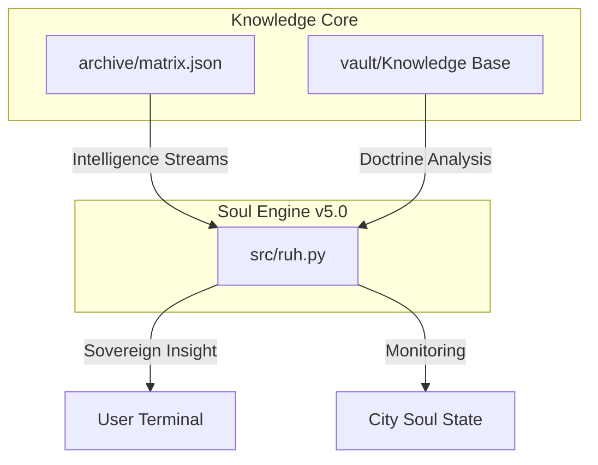

# 🌊 WORDS OF ISTANBUL (v5.0-OMEGA)
### *A Unified Urban Intelligence Ecosystem & Sovereign Doctrine* 🏙️🧬🧠

---

## 🦾 THE OMEGA MANIFESTO
**v5.0-OMEGA** is more than a repository; it is an **Integrated Urban Intelligence System**. We have moved beyond simple literary collections into a structured, automated, and high-density matrix that anatomizes the "Soul of the City."

KULLANICI and **Antigravity** cooperation has forged a single source of truth for the metaphysical, topographical, and historical essence of Istanbul.

---

## 🕸️ SYSTEM ARCHITECTURE

---

## ⚙️ OMEGA OPERATIONS: THE SOUL ENGINE

The **Soul Engine (v5.0-OMEGA)** is the primary interface for interacting with the city's matrix.

| Command | Action |
| :--- | :--- |
| `python src/ruh.py --monitor` | **Urban state summary** + doctrine stream sample |
| `python src/ruh.py --scan <key>` | **Deep scan**: matrix + vault (with excerpt) |
| `python src/ruh.py --oracle` | **Random insight** from the matrix |
| `python src/ruh.py --derive` | **Psychogeographical route** (3 nodes) |
| `python src/ruh.py --stats` | **Analytics**: counts, dominant mood, top layers |
| `python src/ruh.py --validate` | **Lint** `archive/matrix.json` structure |
| `python src/ruh.py --serve` | **Local dashboard** at `http://127.0.0.1:8765/dashboard/` |

---

## 🏛️ EPESTEMIC VAULT (CONSOLIDATED)

All knowledge nodes are now consolidated in the [vault/](./vault) directory:
- [📄 Canon](./vault/canon.md): Iconic literary and poetic works.
- [📄 Doctrine](./vault/doctrine.md): Strategic risk and kentsel beka analysis.
- [📄 Compendium](./vault/compendium.md): Master quotes and musical matrix.
- [📄 Psychology](./vault/psychology.md): Hüzün, collective melancholy, and spatial neurosis.
- [📄 History](./vault/history.md): Imperial traces and sovereign politics.
- [📄 Mythology](./vault/mythology.md): Foundation myths and ancient secrets.

---

## 📊 CITY SOUL DASHBOARD (SIMULATED)
> [!IMPORTANT]
> **Dominant Mood**: `Sovereign Complexity`
> **Matrix Density**: `25 curated nodes` (validated via `--validate`)
> **Sovereignty Level**: `S6 (Masterclass Grade)`

---

## 🛠️ HANDOVER PROTOCOL
1. **Sync**: Finalize all [vault/](./vault) edits.
2. **Logic**: Validate [src/ruh.py](./src/ruh.py) for path integrity.
3. **Commit**: `git add . && git commit -m "feat: release v5.0-OMEGA Integrated System"`
4. **Push**: `git push origin main`

---
*Istanbul is not a city; it is a way of being.*