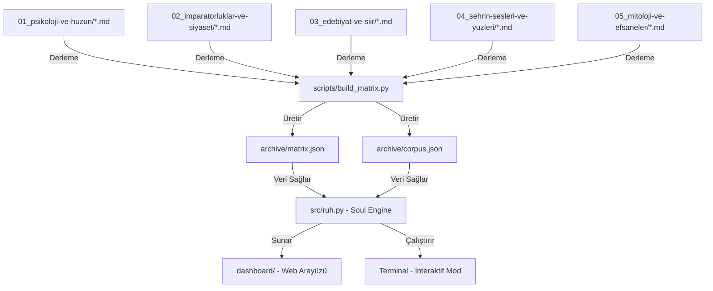

<div align="center">


# 🌉 Words of Istanbul (İstanbul'un Sözleri)
### *v6.0-RESURRECTION — NFK Pivotu, Şehir Corpusu ve Psikocoğrafi Keşif Motoru*

[](./)
[](./archive/corpus.json)
[](./archive/matrix.json)

> *"Ruhumu eritip de kalıpta dondurmuşlar;  
> Onu İstanbul diye toprağa kondurmuşlar."*  
> — **Necip Fazıl Kısakürek**

</div>

---

## 📖 Proje Hakkında

**Words of Istanbul (İstanbul'un Sözleri)**; İstanbul'un binlerce yıllık tarihini, kültürel katmanlarını, sokak seslerini, edebi mirasını ve efsanelerini bir araya getiren **corpus-tabanlı bir şehir belleği ve psikocoğrafi keşif motorudur**. 

Proje, şehrin soyut ruhunu ve somut gerçekliğini beş ana tema (sütun) altında sınıflandırarak dijital bir arşive dönüştürür. Geliştirilen **Soul Engine (RUH)** aracı sayesinde, bu arşiv üzerinde anlık aramalar yapabilir, rastgele içgörüler (Oracle) üretebilir, 3 duraklı yürüyüş rotaları (Dérive) tasarlayabilir ve tüm bu verileri dinamik bir web arayüzü üzerinden görselleştirebilirsiniz.

---

## 📚 Beş Kültürel Sütun

Projenin temelini oluşturan makaleler ve edebi denemeler, İstanbul'un farklı bir boyutunu temsil eden beş klasör altında toplanmıştır:

| Sütun | Tema ve Odak Noktaları | Kapsam ve İçerik |
| :--- | :--- | :--- |
| **[01_psikoloji-ve-huzun](./01_psikoloji-ve-huzun/)** | Hüzün, Kimlik ve Kaos | Şehrin bireysel ve kolektif melankolisi, Galata Köprüsü'ndeki balıkçıların psikoterapisi, Haliç sislerindeki yalnızlık, iki kıta arasındaki araf hali ve kaosun estetik güzelliği. |
| **[02_imparatorluklar-ve-siyaset](./02_imparatorluklar-ve-siyaset/)** | Tarih, İhtişam ve Güç | Doğu Roma (Bizans) ve Osmanlı İmparatorluğu'nun siyasi merkezi olarak Konstantinopolis, saray bahçelerinden sokaklara yansıyan diplomasi, Yedikule Zindanları'nın karanlık tarihi. |
| **[03_edebiyat-ve-siir](./03_edebiyat-ve-siir/)** | Edebi Tahayyül ve Şiir | Divan edebiyatında Dersaadet övgüleri, seyyahların gözlemleri, oryantalist yazarların oryantalist fantezileri, Ahmet Hamdi Tanpınar'ın zaman algısı ve modern şairlerin (Yahya Kemal, Orhan Veli, Necip Fazıl) İstanbul'u. |
| **[04_sehrin-sesleri-ve-yuzleri](./04_sehrin-sesleri-ve-yuzleri/)** | Gündelik Hayat ve Sokaklar | Vapurlar, martı çığlıkları, Eminönü'nün insan seli, sokak kedileri ile esnaf arasındaki simbiyotik ilişki ve akşam sokaklarında yankılanan boza satıcılarının sesleri. |
| **[05_mitoloji-ve-efsaneler](./05_mitoloji-ve-efsaneler/)** | Kadim Sırlar ve Tılsımlar | Byzantion'un kuruluş kehaneti, Kız Kulesi'nin trajik hikayesi, Ayasofya'nın gizli yeraltı dehlizleri, Yerebatan Sarnıcı'ndaki Medusa bakışı, Altın Boynuz (Haliç) efsaneleri ve yedi tepenin gizemi. |

---

## 🕸️ Mimari Yapı ve Bilgi Akışı

Proje, statik Markdown dosyalarından beslenen ve dinamik olarak derlenen bir veritabanı yapısına sahiptir:

1. **Denemeler (Raw Data)**: Klasörlerdeki `.md` dosyalarında yazarların, şairlerin ve kullanıcıların İstanbul gözlemleri bulunur.
2. **Matrix Derleyici (`build_matrix.py`)**: Tüm denemeleri tarar; makalelerdeki alıntı bloklarını (`>`), başlıkları, kategorileri ve duygu durumlarını analiz ederek `archive/corpus.json` ve `archive/matrix.json` dosyalarını otomatik olarak oluşturur.
3. **Soul Engine (Ruh - `src/ruh.py`)**: Terminal veya API üzerinden bu derlenmiş veri tabanını sorgulayan, arayan ve analiz eden ana kontrol mekanizmasıdır.
4. **Görsel Dashboard (`dashboard/`)**: HTML, CSS, Vanilla JS ve Chart.js kullanılarak oluşturulan ve verileri görselleştiren tarayıcı arayüzü.


```mermaid
graph TD
    A[01_psikoloji-ve-huzun/*.md] -->|Derleme| BM[scripts/build_matrix.py]
    B[02_imparatorluklar-ve-siyaset/*.md] -->|Derleme| BM
    C[03_edebiyat-ve-siir/*.md] -->|Derleme| BM
    D[04_sehrin-sesleri-ve-yuzleri/*.md] -->|Derleme| BM
    E[05_mitoloji-ve-efsaneler/*.md] -->|Derleme| BM
    
    BM -->|Üretir| MC[archive/corpus.json]
    BM -->|Üretir| MM[archive/matrix.json]
    
    MM -->|Veri Sağlar| RE[src/ruh.py - Soul Engine]
    MC -->|Veri Sağlar| RE
    
    RE -->|Sunar| DB[dashboard/ - Web Arayüzü]
    RE -->|Çalıştırır| TM[Terminal - İnteraktif Mod]
```

---

## ⚙️ Soul Engine (RUH) CLI Kullanımı

`src/ruh.py` betiği, projenin komut satırı arayüzüdür. Aşağıdaki parametrelerle çalıştırılabilir:

| Komut | Açıklama |
| :--- | :--- |
| `python src/ruh.py --corpus` | Sistemdeki tüm denemeleri sütunlarına göre listeler. |
| `python src/ruh.py --read <slug>` | Belirtilen slug adına sahip denemenin tüm içeriğini ekrana yazdırır. |
| `python src/ruh.py --scan <kelime>` | Matrix veritabanı ve corpus dosyalarında eşzamanlı metin araması yapar. |
| `python src/ruh.py --oracle` | Şehir matrixinden rastgele bir içgörü/alıntı seçer ve ekrana yazdırır. |
| `python src/ruh.py --derive` | Psikocoğrafi yürüyüşler için rastgele 3 duraklı bir rota (Dérive) önerir. |
| `python src/ruh.py --monitor` | Şehrin o anki ruh hali özetini (ortalama etki, baskın duygu, düğüm sayıları) listeler. |
| `python src/ruh.py --stats` | Şehir matrixinin detaylı istatistiklerini ve katman dağılımlarını gösterir. |
| `python src/ruh.py --validate` | `matrix.json` dosyasının bütünlüğünü ve şemasını doğrular. |
| `python src/ruh.py --rebuild` | `scripts/build_matrix.py` betiğini tetikleyerek veritabanını sıfırdan derler. |
| `python src/ruh.py --serve` | Dashboard web sunucusunu varsayılan `8765` portunda başlatır. |
| `python src/ruh.py -i` | **İnteraktif Terminal Arayüzünü** başlatır (Bkz. alt başlık). |

*Kök dizinden doğrudan çalıştırmak için:* `python ruh.py --oracle` (kök dizinde `ruh.py` yönlendiricisi bulunmaktadır).

### 🕹️ İnteraktif Terminal Arayüzü (`python src/ruh.py -i`)

İnteraktif moda girdiğinizde sizi şu seçeneklerin yer aldığı renkli bir kontrol paneli karşılar:
* **[1] Oracle (Günün Kahini)**: Şehrin derinliklerinden rastgele bir fısıltı getirir.
* **[2] Dérive (Rastgele Rota)**: İstanbul sokaklarında kaybolmanız için 3 duraklı psikomitolojik bir yolculuk haritası çıkarır.
* **[3] Scan (Arama)**: Arama teriminize uyan tüm denemeleri ve matrix düğümlerini listeler.
* **[4] Monitor (Şehir Durumu)**: Şehir ruhu endeksini (City Soul Index) ve anlık verileri sunar.
* **[5] Stats (Metrikler)**: Detaylı sayısal dağılımları listeler.
* **[6] Corpus (Kütüphane)**: Denemeler arasında gezerek doğrudan terminal üzerinden okuma yapmanızı sağlar.
* **[7] Gözlem Ekle (Yeni Kayıt)**: Şehre dair kendi gözleminizi yazmanızı sağlar. Seçtiğiniz katmana göre `kullanici-gozlemleri.md` dosyası oluşturulur/güncellenir ve veritabanı otomatik olarak yeniden derlenir.

---

## 🖥️ Web Dashboard (Kontrol Paneli)

Projenin web arayüzü, verileri modern ve dinamik bir biçimde sunar:
* **Gelişmiş Metrikler**: Toplam düğüm sayısı, deneme sayısı ve son senkronizasyon tarihi gösterilir.
* **Katman Grafiği**: Chart.js kütüphanesi kullanılarak hazırlanan halka (doughnut) grafiğiyle katmanların ağırlığı görselleştirilir.
* **Arama & Filtreleme**: Canlı arama kutusu ve katman filtresiyle matrix akışı anlık olarak daraltılabilir.
* **Oracle & Dérive Butonları**: Web arayüzü üzerinden anlık toast bildirimleriyle rastgele alıntılar ve rotalar üretilir.
* **Pillar Listesi**: Her bir kültürel sütun altındaki denemelere doğrudan linkler sunulur.

### 🌐 Dashboard'u Yerel Olarak Çalıştırma

```bash
python src/ruh.py --serve
```
Sunucu başladığında tarayıcınızda otomatik olarak [http://127.0.0.1:8765/dashboard/index.html](http://127.0.0.1:8765/dashboard/index.html) adresi açılacaktır.

---

## 🔧 Geliştirme ve Mühürleme Prosedürü

Eğer yeni bir deneme ekler veya mevcut olanları güncellerseniz, index dosyalarını güncellemek ve projeyi doğrulamak için şu adımları izleyin:

1. **Veritabanını Yeniden Derleyin**:
   ```bash
   python scripts/build_matrix.py
   ```
2. **Yapıyı Doğrulayın**:
   ```bash
   python src/ruh.py --validate
   ```
3. **Hızlı Mühürleme (Windows)**:
   Proje dizininde yer alan `muhurle.bat` dosyası tüm bu adımları otomatikleştirir. Dosyayı çalıştırdığınızda sırasıyla:
   * Matrix yeniden derlenir.
   * Doğrulama (`--validate`) adımı çalıştırılır.
   * Eğer hata yoksa tüm değişiklikler git'e eklenir (`git add -A`).
   * `"feat: v6 corpus sync and matrix rebuild"` mesajıyla commit'lenir.
   * Uzak sunucuya (`origin main`) push'lanır.

---

*İstanbul bir şehir değil; bir olma biçimidir.*
