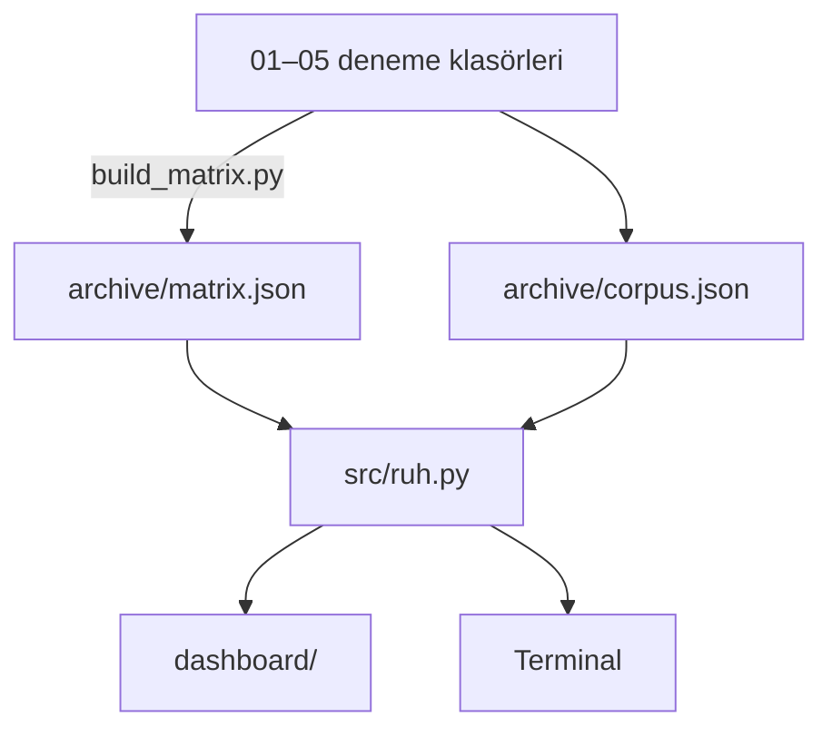

<div align="center">


# 🌉 Words of Istanbul (İstanbul'un Sözleri)
### *v6.0-RESURRECTION — NFK pivot & şehir corpusu*

[](./)
[](./archive/corpus.json)
[](./archive/matrix.json)

> *"Ruhumu eritip de kalıpta dondurmuşlar;  
> Onu İstanbul diye toprağa kondurmuşlar."*  
> — **Necip Fazıl Kısakürek**


---

## 📚 Beş sütun

| Sütun | İçerik |
| :--- | :--- |
| [01_psikoloji-ve-huzun](./01_psikoloji-ve-huzun/) | Hüzün, kimlik, kaos ve melankoli |
| [02_imparatorluklar-ve-siyaset](./02_imparatorluklar-ve-siyaset/) | Roma, Bizans, Osmanlı, diplomasi |
| [03_edebiyat-ve-siir](./03_edebiyat-ve-siir/) | Divan, seyyahlar, NFK, modern şiir |
| [04_sehrin-sesleri-ve-yuzleri](./04_sehrin-sesleri-ve-yuzleri/) | Vapur, martı, esnaf, sokak kedileri |
| [05_mitoloji-ve-efsaneler](./05_mitoloji-ve-efsaneler/) | Byzantion, Kız Kulesi, Ayasofya, Haliç |

---

## 🕸️ Mimari


```mermaid
graph TD
    E[01–05 deneme klasörleri] -->|build_matrix.py| M[archive/matrix.json]
    E --> C[archive/corpus.json]
    M --> R[src/ruh.py]
    C --> R
    R --> D[dashboard/]
    R --> T[Terminal]
```

---

## ⚙️ Soul Engine (v6)

| Komut | Açıklama |
| :--- | :--- |
| `python src/ruh.py --corpus` | Tüm denemeleri listele |
| `python src/ruh.py --read melankoli-ve-yikinti-estetigi` | Bir denemeyi oku |
| `python src/ruh.py --scan hüzün` | Matrix + corpus araması |
| `python src/ruh.py --oracle` | Rastgele içgörü |
| `python src/ruh.py --derive` | 3 duraklı dérive rotası |
| `python src/ruh.py --monitor` | Şehir ruhu özeti |
| `python src/ruh.py --stats` | Matrix istatistikleri |
| `python src/ruh.py --validate` | `matrix.json` doğrula |
| `python src/ruh.py --rebuild` | Corpus'tan matrix yeniden üret |
| `python src/ruh.py --serve` | Dashboard: `http://127.0.0.1:8765/dashboard/` |

Kökten de çalışır: `python ruh.py --oracle`

---

## 🔧 Geliştirme

```bash
python scripts/build_matrix.py   # archive/*.json güncelle
python src/ruh.py --validate
python src/ruh.py --serve
```

Windows hızlı mühür: `muhurle.bat` (validate + commit + push)

---

*İstanbul bir şehir değil; bir olma biçimidir.*
